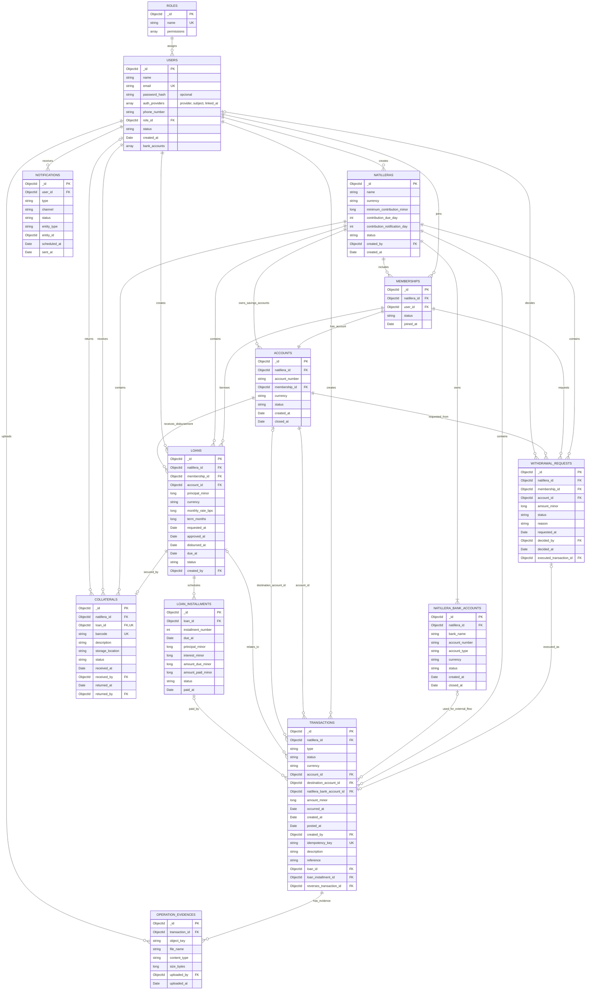

# Esquema MongoDB: diagrama

```mermaid
erDiagram
    ROLES {
        ObjectId _id PK
        string name UK
        array permissions
    }

    USERS {
        ObjectId _id PK
        string name
        string email UK
        string password_hash "opcional"
        array auth_providers "provider, subject, linked_at"
        string phone_number
        ObjectId role_id FK
        string status
        Date created_at
        array bank_accounts
    }

    NATILLERAS {
        ObjectId _id PK
        string name
        string currency
        long minimum_contribution_minor
        int contribution_due_day
        int contribution_notification_day
        string status
        ObjectId created_by FK
        Date created_at
    }

    MEMBERSHIPS {
        ObjectId _id PK
        ObjectId natillera_id FK
        ObjectId user_id FK
        string status
        Date joined_at
    }

    ACCOUNTS {
        ObjectId _id PK
        ObjectId natillera_id FK
        string account_number
        ObjectId membership_id FK
        string currency
        string status
        Date created_at
        Date closed_at
    }

    NATILLERA_BANK_ACCOUNTS {
        ObjectId _id PK
        ObjectId natillera_id FK
        string bank_name
        string account_number
        string account_type
        string currency
        string status
        Date created_at
        Date closed_at
    }

    TRANSACTIONS {
        ObjectId _id PK
        ObjectId natillera_id FK
        string type
        string status
        string currency
        ObjectId account_id FK
        ObjectId destination_account_id FK
        ObjectId natillera_bank_account_id FK
        long amount_minor
        Date occurred_at
        Date created_at
        Date posted_at
        ObjectId created_by FK
        string idempotency_key UK
        string description
        string reference
        ObjectId loan_id FK
        ObjectId loan_installment_id FK
        ObjectId reverses_transaction_id FK
    }

    LOANS {
        ObjectId _id PK
        ObjectId natillera_id FK
        ObjectId membership_id FK
        ObjectId account_id FK
        long principal_minor
        string currency
        long monthly_rate_bps
        long term_months
        Date requested_at
        Date approved_at
        Date disbursed_at
        Date due_at
        string status
        ObjectId created_by FK
    }

    COLLATERALS {
        ObjectId _id PK
        ObjectId natillera_id FK
        ObjectId loan_id FK, UK
        string barcode UK
        string description
        string storage_location
        string status
        Date received_at
        ObjectId received_by FK
        Date returned_at
        ObjectId returned_by FK
    }

    WITHDRAWAL_REQUESTS {
        ObjectId _id PK
        ObjectId natillera_id FK
        ObjectId membership_id FK
        ObjectId account_id FK
        long amount_minor
        string status
        string reason
        Date requested_at
        ObjectId decided_by FK
        Date decided_at
        ObjectId executed_transaction_id FK
    }

    LOAN_INSTALLMENTS {
        ObjectId _id PK
        ObjectId loan_id FK
        int installment_number
        Date due_at
        long principal_minor
        long interest_minor
        long amount_due_minor
        long amount_paid_minor
        string status
        Date paid_at
    }

    OPERATION_EVIDENCES {
        ObjectId _id PK
        ObjectId transaction_id FK
        string object_key
        string file_name
        string content_type
        long size_bytes
        ObjectId uploaded_by FK
        Date uploaded_at
    }

    NOTIFICATIONS {
        ObjectId _id PK
        ObjectId user_id FK
        string type
        string channel
        string status
        string entity_type
        ObjectId entity_id
        Date scheduled_at
        Date sent_at
    }

    ROLES ||--o{ USERS : assigns
    USERS ||--o{ NATILLERAS : creates
    USERS ||--o{ MEMBERSHIPS : joins
    NATILLERAS ||--o{ MEMBERSHIPS : includes
    MEMBERSHIPS ||--|| ACCOUNTS : has_account
    NATILLERAS ||--o{ ACCOUNTS : owns_savings_accounts
    NATILLERAS ||--|{ NATILLERA_BANK_ACCOUNTS : owns
    MEMBERSHIPS ||--o{ LOANS : borrows
    NATILLERAS ||--o{ LOANS : contains
    USERS ||--o{ LOANS : creates
    ACCOUNTS ||--o{ LOANS : receives_disbursement
    LOANS ||--o| COLLATERALS : secured_by
    NATILLERAS ||--o{ COLLATERALS : contains
    USERS ||--o{ COLLATERALS : receives
    USERS o|--o{ COLLATERALS : returns
    LOANS ||--o{ LOAN_INSTALLMENTS : schedules
    NATILLERAS ||--o{ WITHDRAWAL_REQUESTS : contains
    MEMBERSHIPS ||--o{ WITHDRAWAL_REQUESTS : requests
    ACCOUNTS ||--o{ WITHDRAWAL_REQUESTS : requested_from
    USERS o|--o{ WITHDRAWAL_REQUESTS : decides
    WITHDRAWAL_REQUESTS o|--o| TRANSACTIONS : executed_as
    NATILLERAS ||--o{ TRANSACTIONS : contains
    NATILLERA_BANK_ACCOUNTS o|--o{ TRANSACTIONS : used_for_external_flow
    USERS ||--o{ TRANSACTIONS : creates
    ACCOUNTS ||--o{ TRANSACTIONS : account_id
    ACCOUNTS o|--o{ TRANSACTIONS : destination_account_id
    LOANS o|--o{ TRANSACTIONS : relates_to
    LOAN_INSTALLMENTS o|--o{ TRANSACTIONS : paid_by
    TRANSACTIONS ||--o{ OPERATION_EVIDENCES : has_evidence
    USERS ||--o{ OPERATION_EVIDENCES : uploads
    USERS ||--o{ NOTIFICATIONS : receives

    %% contribution_due_day usa 16 por defecto; los dos dias de aporte son configurables por natillera.
    %% Si un dia configurado no existe en el mes, se usa el ultimo dia de ese mes.
    %% USERS.role_id referencia un rol global, no uno por natillera.
    %% USERS.bank_accounts representa cuentas externas del usuario; NATILLERA_BANK_ACCOUNTS son cuentas propias de la natillera.
    %% Los roles son globales; permissions expresa permisos por modulo y opcion (listar, crear, editar, eliminar).
    %% ROLES.name: administrator, member, borrower. USERS.role_id define el rol global.
    %% NATILLERAS.currency y los montos financieros corresponden a COP; los montos se guardan en centavos.
    %% Cada MEMBERSHIP tiene exactamente una cuenta interna (indice unico accounts.membership_id).
    %% Cada natillera debe registrar al menos una cuenta bancaria propia; esta cantidad minima se valida en la aplicacion.
    %% En Release 1 las transferencias internas se registran manualmente; solo las confirmadas afectan saldos, debitando el origen y acreditando el destino.
    %% TRANSACTIONS.type=transfer requiere account_id como origen y destination_account_id como destino; ambas cuentas deben pertenecer a la misma natillera.
    %% Solo transactions.status=posted afecta saldos; las anulaciones conservan el historial mediante reversal.
    %% amount_minor es positivo; reference/description y created_by documentan el registro manual. Las transferencias entre natilleras distintas no se permiten.
    %% WITHDRAWAL_REQUESTS se aprueba o rechaza; solo una transaccion ejecutada y confirmada afecta el saldo.
    %% LOANS sigue solicitado, aprobado, rechazado y desembolsado; mensual_rate_bps permanece fija durante el plazo.
    %% COLLATERALS es opcional, con maximo uno por prestamo (loan_id unico); barcode es unico y solo se devuelve con la deuda saldada.
    %% LOAN_INSTALLMENTS representa cuotas francesas mensuales; due_at ajusta dias inexistentes al ultimo dia del mes.
    %% NOTIFICATIONS registra avisos in-app/SMS; los vencidos pueden repetirse hasta registrarse el pago.
    %% OPERATION_EVIDENCES guarda solo metadatos y object_key de S3 privado, nunca el binario; admite JPG, PNG y PDF, hasta 10 MiB por archivo.
    %% El maximo de 5 evidencias y 50 MiB totales por operacion, y el limite de retiro por saldo disponible, se validan en la aplicacion.
    %% ACCOUNTS.natillera_id debe coincidir con la natillera de su MEMBERSHIP.
    %% Las referencias entre documentos, la pertenencia al mismo tenant, la devolucion de prendas tras pago total y estados condicionados se validan en la aplicacion.
    %% Indices unicos: USERS(email), USERS(auth_providers.provider y auth_providers.subject), ROLES(name), MEMBERSHIPS(natillera_id, user_id), ACCOUNTS(membership_id y natillera_id/account_number), COLLATERALS(loan_id y barcode), LOAN_INSTALLMENTS(loan_id/installment_number), TRANSACTIONS(natillera_id/idempotency_key).
```
