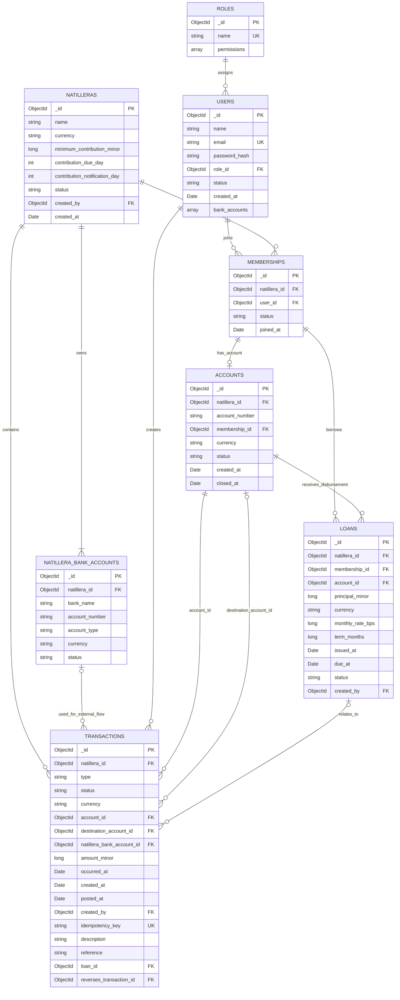

# Esquema MongoDB: diagrama

```mermaid
erDiagram
    ROLES {
        ObjectId _id PK
        string name UK
        array permissions
    }

    USERS {
        ObjectId _id PK
        string name
        string email UK
        string password_hash
        ObjectId role_id FK
        string status
        Date created_at
        array bank_accounts
    }

    NATILLERAS {
        ObjectId _id PK
        string name
        string currency
        long minimum_contribution_minor
        int contribution_due_day
        int contribution_notification_day
        string status
        ObjectId created_by FK
        Date created_at
    }

    MEMBERSHIPS {
        ObjectId _id PK
        ObjectId natillera_id FK
        ObjectId user_id FK
        string status
        Date joined_at
    }

    ACCOUNTS {
        ObjectId _id PK
        ObjectId natillera_id FK
        string account_number
        ObjectId membership_id FK
        string currency
        string status
        Date created_at
        Date closed_at
    }

    NATILLERA_BANK_ACCOUNTS {
        ObjectId _id PK
        ObjectId natillera_id FK
        string bank_name
        string account_number
        string account_type
        string currency
        string status
    }

    TRANSACTIONS {
        ObjectId _id PK
        ObjectId natillera_id FK
        string type
        string status
        string currency
        ObjectId account_id FK
        ObjectId destination_account_id FK
        ObjectId natillera_bank_account_id FK
        long amount_minor
        Date occurred_at
        Date created_at
        Date posted_at
        ObjectId created_by FK
        string idempotency_key UK
        string description
        string reference
        ObjectId loan_id FK
        ObjectId reverses_transaction_id FK
    }

    LOANS {
        ObjectId _id PK
        ObjectId natillera_id FK
        ObjectId membership_id FK
        ObjectId account_id FK
        long principal_minor
        string currency
        long monthly_rate_bps
        long term_months
        Date issued_at
        Date due_at
        string status
        ObjectId created_by FK
    }

    ROLES ||--o{ USERS : assigns
    USERS ||--o{ MEMBERSHIPS : joins
    NATILLERAS ||--o{ MEMBERSHIPS : includes
    MEMBERSHIPS ||--o| ACCOUNTS : has_account
    NATILLERAS ||--|{ NATILLERA_BANK_ACCOUNTS : owns
    MEMBERSHIPS ||--o{ LOANS : borrows
    NATILLERAS ||--o{ TRANSACTIONS : contains
    NATILLERA_BANK_ACCOUNTS o|--o{ TRANSACTIONS : used_for_external_flow
    USERS ||--o{ TRANSACTIONS : creates
    ACCOUNTS ||--o{ LOANS : receives_disbursement
    ACCOUNTS ||--o{ TRANSACTIONS : account_id
    ACCOUNTS o|--o{ TRANSACTIONS : destination_account_id
    LOANS o|--o{ TRANSACTIONS : relates_to

    %% contribution_due_day usa 16 por defecto; los dos dias de aporte son configurables por natillera.
    %% Si un dia configurado no existe en el mes, se usa el ultimo dia de ese mes.
    %% USERS.role_id referencia un rol global, no uno por natillera.
    %% USERS.bank_accounts es una lista informativa de cuentas bancarias externas.
    %% NATILLERA_BANK_ACCOUNTS son cuentas propias de la natillera para recaudos y desembolsos.
    %% Cada MEMBERSHIP tiene como maximo una cuenta interna de la natillera.
    %% Para transferencias, account_id es origen y destination_account_id es destino.
    %% amount_minor es positivo; el tipo de transaccion determina su efecto en el saldo.
    %% ACCOUNTS.natillera_id debe coincidir con la natillera de su MEMBERSHIP.
    %% La pertenencia de transacciones y cuentas origen/destino a la misma natillera debe validarse en la aplicacion.
    %% Indices unicos: USERS(email), ROLES(name), MEMBERSHIPS(natillera_id, user_id), ACCOUNTS(membership_id), TRANSACTIONS(natillera_id, idempotency_key).
```
